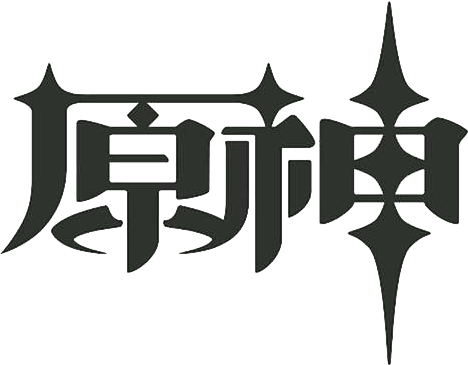

---
# 页面路径
permalinkPattern: 2023/11/28/ysstart/

title: 原神启动!!! css动画详解。
description: 纯css动画实现原神启动，简单秒懂。
tag: ["前端","css"]
# star: true
head: 
    - [meta, { name: keywords , content: css动画 fixed }]

# sitemap 如果为 false 则不写入
# 更新频率 changefreq -> "always" | "hourly" | "daily" | "weekly" | "monthly" | "yearly" | "never"
# 优先级 priority -> 范围 0 至 1。

sitemap:
    changefreq: never
    priority: 0.5

# 启用评论评论
comment: true
---

<script setup>
import {ref,computed} from "vue"
const test1p = ref("absolute");
const test1x = ref("left");
const test1xin = ref("1px");
const test1y = ref("top")
const test1yin = ref("1px");
const test1style =  computed(()=>{
    return `position: ${test1p.value};
    ${test1x.value}:${test1xin.value};
    ${test1y.value}:${test1yin.value};`
});
const test1code = computed(()=>{
    return `img.ys{
    ${test1style.value}
}`
});
</script>

# 原神启动css动画和实现详解

## 了解position的三个属性

```position``` 通常需要和 ```top```,```bottom``` ,```left```,```right``` 这四个属性配合起来一起使用。

- ```top``` 代表当前元素上方的距离。
- ```bottom``` 代表当前元素下方的距离。
- ```left```,```right``` 以此类推，分别代表左边和右边。

<Demo title="试一试">
    <div style="display: flex;flex-direction: row;align-items: stretch;">
        <div style="position: relative;flex: 1;border: 1px solid var(--color);min-height: 5rem;">
            
        </div>
        <pre style="flex: 1;margin: 0;" >{{test1code}}</pre>
        <div  style="flex: 1">
            左右 <button @click="test1x='left'">left</button> <button @click="test1x='right'">right</button>
            <input type="text" v-model="test1xin">
            <br/>
            上下 <button @click="test1y='top'">top</button> <button @click="test1y='bottom'">bottom</button>
            <input type="text"  v-model="test1yin">
            <br/>
            定位 <button @click="test1p='fixed'">fixed</button> <button @click="test1p='relative'">relative</button> <button @click="test1p='absolute'">absolute</button>
        </div>
    </div>
</Demo>

### fixed

### relative

### absolute


<Demo title="试一试">
    <div style="display: flex;flex-direction: row;align-items: stretch;">
        <div style="position: relative;flex: 1;border: 1px solid var(--color);min-height: 5rem;">
            <p style="margin: 0;">hello</p>
            
            <p style="margin: 0;">hello</p>
        </div>
        <pre style="flex: 1;margin: 0;" >{{test1code}}</pre>
        <div  style="flex: 1">
            左右 <button @click="test1x='left'">left</button> <button @click="test1x='right'">right</button>
            <input type="text" v-model="test1xin">
            <br/>
            上下 <button @click="test1y='top'">top</button> <button @click="test1y='bottom'">bottom</button>
            <input type="text"  v-model="test1yin">
            <br/>
            定位 <button @click="test1p='fixed'">fixed</button> <button @click="test1p='relative'">relative</button> <button @click="test1p='absolute'">absolute</button>
        </div>
    </div>
</Demo>


<!-- ~~~ -->

<div class="start-main">
    
    <div class="yuantext">
        <p>抵制不良游戏，拒绝盗版游戏。注意自我保护，谨防受骗上当。适度游戏益脑，沉迷游戏伤身。合理安排时间，享受健康生活。</p>
        <p>此界面仅用于学习和交流</p>
    </div>
</div>

<style scoped>
.yuantext p{
    margin: 0;
    font-weight: bolder;
    font-size:1rem
}
.yuantext{
    width: 100%;
    position: absolute;
    bottom: 0;
    margin-bottom: 1rem;
    text-align: center;
    animation: yuantext-animation 7s linear 0s 1;
}
.yuanimg{
    background-color: #ffffff00;
    position: absolute;
    left: 50%;
    top: 50%;
    transform: translate(-50%, -50%);
    width: 40vmin;
    animation: yuanimg-animation 7s linear 0s 1;
}
.start-main{
    position: fixed;
    top: 0;
    left: 0;
    height: 100vh;
    width: 100vw;
    background-color: white;
    animation: start-main-animation 7s linear 0s 1;
    opacity: 0;
    z-index: -99;
}
@keyframes yuantext-animation{
    0% {
        opacity: 0%;
    }
    10% {
        opacity: 0%;
    }
    45% {
        opacity: 100%;
    }
    70% {
        opacity: 100%;
    }
    90% {
        opacity: 0%;
    }
    100% {
        opacity: 0%;
    }
}
@keyframes yuanimg-animation{
    0% {
        opacity: 0%;
    }
    45% {
        opacity: 100%;
    }
    70% {
        opacity: 100%;
    }
    90% {
        opacity: 0%;
    }
    100% {
        opacity: 0%;
    }
}
@keyframes start-main-animation{
    0% {
        opacity: 100%;
        z-index: 100;
    }
    90% {
        opacity: 100%;
    }
    100% {
        opacity: 0%;
        z-index: 100;
    }
}
</style>
